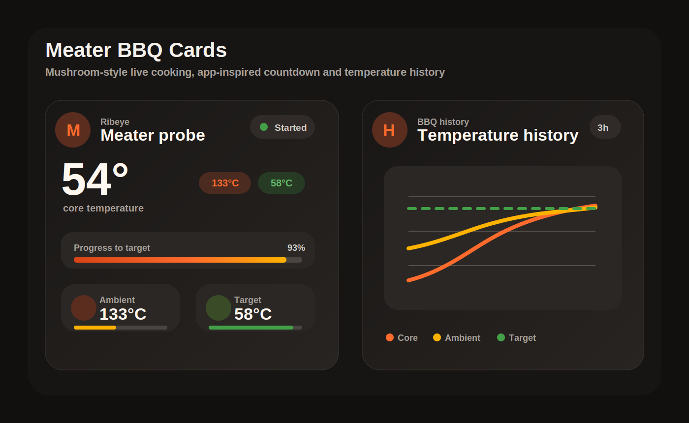
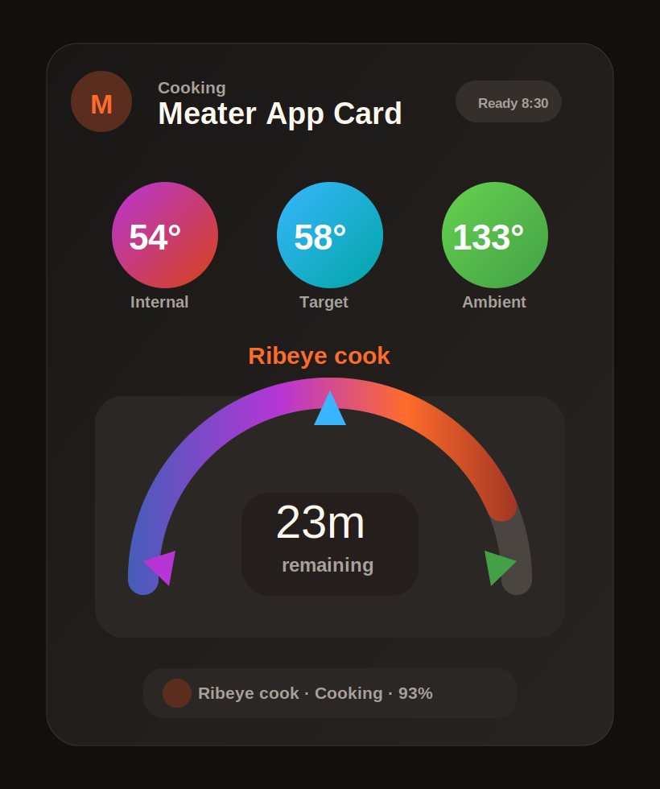

# Meater Home Assistant Cards

Mushroom-style Lovelace cards for Meater probe sensors in Home Assistant.

The repository ships six frontend cards:

- `custom:meater-probe-card` for live core temperature, ambient temperature, target, timing, status, and progress.
- `custom:meater-probe-history-card` for BBQ-style temperature history.
- `custom:meater-compact-card` for a smaller live tile with remaining time.
- `custom:meater-countdown-card` for a remaining-time first cooking card.
- `custom:meater-strip-card` for a slim section/dashboard status strip.
- `custom:meater-app-card` for a MEATER-app inspired Mushroom-style card with temperature bubbles and a remaining-time arc.





## Installation

### HACS

1. Open HACS.
2. Add `https://github.com/gielk/meater-bbq-card` as a custom repository.
3. Choose category `Dashboard`.
4. Install `Meater BBQ Cards`.
5. Refresh the browser cache.

HACS should add the frontend resource automatically. If you add it manually, use:

```yaml
url: /hacsfiles/meater-bbq-card/meater-bbq-card.js
type: module
```

### Manual

Copy `meater-bbq-card.js` to `www/community/meater-bbq-card/meater-bbq-card.js` and add this dashboard resource:

```yaml
url: /local/community/meater-bbq-card/meater-bbq-card.js
type: module
```

## Quick Start

After installation, the cards are available in the Home Assistant card picker as `Meater Probe Card`, `Meater Probe History`, `Meater Compact Card`, `Meater Countdown Card`, `Meater Strip Card`, and `Meater App Card`.

For a single Meater probe, the cards usually auto-detect the sensor set:

```yaml
type: custom:meater-probe-card
```

Add the history card below it:

```yaml
type: custom:meater-probe-history-card
hours_to_show: 3
refresh_interval: 300
chart_line_width: 4
core_line_color: "#ff6b2c"
ambient_line_color: "#ffb300"
target_line_color: "#43a047"
```

## Alternative Cards

Use the compact card when you want a tile-style card that still shows the important values, including `remaining_time`:

```yaml
type: custom:meater-compact-card
entity_prefix: meater_probe_ac7269c8
```

Use the countdown card when the remaining cook time should be the main visual focus:

```yaml
type: custom:meater-countdown-card
entity_prefix: meater_probe_ac7269c8
```

Use the strip card for a slim dashboard row:

```yaml
type: custom:meater-strip-card
entity_prefix: meater_probe_ac7269c8
```

Use the app card when you want a MEATER-app inspired layout with round internal, target, and ambient temperature indicators plus a large remaining-time arc:

```yaml
type: custom:meater-app-card
entity_prefix: meater_probe_ac7269c8
```

You can also restyle the cards with shared palette and thickness settings:

```yaml
type: custom:meater-app-card
entity_prefix: meater_probe_ac7269c8
hot_color: "#ff5500"
steak_color: "#991100"
green_color: "#22aa55"
progress_bar_height: 14
tile_meter_height: 7
app_arc_width: 36
app_core_color: "#8a00ff"
app_target_color: "#0099ff"
app_ambient_color: "#00cc44"
```

## Entity Matching

The cards look for Meater-style sensor suffixes, including the Dutch entity names from the current dashboard:

- `sensor.*_interne_temperatuur`
- `sensor.*_omgevingstemperatuur`
- `sensor.*_doeltemperatuur`
- `sensor.*_piektemperatuur`
- `sensor.*_kookstatus`
- `sensor.*_kookt`
- `sensor.*_resterende_tijd`
- `sensor.*_tijd_verstreken`

English-style suffixes such as `*_core_temperature`, `*_ambient_temperature`, and `*_target_temperature` are also supported.

If auto-detection cannot find the right probe, configure the core sensor or the entity prefix:

```yaml
type: custom:meater-probe-card
core_temp: sensor.meater_probe_ac7269c8_interne_temperatuur
```

or:

```yaml
type: custom:meater-probe-card
entity_prefix: meater_probe_ac7269c8
```

You can also explicitly configure the remaining time sensor. This is useful if your Meater integration uses a translated entity name:

```yaml
type: custom:meater-countdown-card
core_temp: sensor.meater_probe_ac7269c8_interne_temperatuur
ambient_temp: sensor.meater_probe_ac7269c8_omgevingstemperatuur
target_temp: sensor.meater_probe_ac7269c8_doeltemperatuur
remaining_time: sensor.meater_probe_ac7269c8_resterende_tijd
```

## Full Example

```yaml
type: sections
title: Meater
sections:
  - cards:
      - type: custom:meater-probe-card
        entity_prefix: meater_probe_ac7269c8
      - type: custom:meater-countdown-card
        entity_prefix: meater_probe_ac7269c8
      - type: custom:meater-strip-card
        entity_prefix: meater_probe_ac7269c8
      - type: custom:meater-app-card
        entity_prefix: meater_probe_ac7269c8
  - cards:
      - type: custom:meater-probe-history-card
        entity_prefix: meater_probe_ac7269c8
        hours_to_show: 3
        refresh_interval: 300
```

## Options

### Shared Options

| Option | Type | Description |
| --- | --- | --- |
| `name` | string | Optional card title. |
| `device_id` | device selector | Optional Home Assistant device selector from the visual editor. |
| `entity_prefix` | string | Prefix such as `meater_probe_ac7269c8`. |
| `core_temp` | entity | Core/internal temperature sensor. |
| `ambient_temp` | entity | Ambient/BBQ temperature sensor. |
| `target_temp` | entity | Target temperature sensor. |
| `peak_temp` | entity | Peak temperature sensor. |
| `cook_status` | entity | Cook status sensor. |
| `cook_name` | entity | Food/cook name sensor. |
| `remaining_time` | entity | Remaining time or estimated finish sensor. |
| `elapsed_time` | entity | Elapsed time or start time sensor. |

### Shared Style Options

In the visual editor, color fields use Home Assistant's built-in color picker.

| Option | Type | Default | Description |
| --- | --- | --- | --- |
| `hot_color` | string | `#ff6b2c` | Main warm accent used across cards. |
| `ember_color` | string | `#ffb300` | Ember/yellow accent used for ambient highlights and gradients. |
| `steak_color` | string | `#d84315` | Deep hot accent used in gradients and core highlights. |
| `green_color` | string | `#43a047` | Green accent used for target and online states. |
| `cool_color` | string | `#00a6a6` | Cool accent used for secondary visuals. |
| `progress_bar_height` | number | `11` | Thickness of the main progress bars. |
| `tile_meter_height` | number | `5` | Thickness of the small meter line in tile-based cards. |

### App Card Style Options

| Option | Type | Default | Description |
| --- | --- | --- | --- |
| `app_arc_width` | number | `30` | Stroke width of the app card half-arc. |
| `app_core_color` | string | `#b735d6` | Color for the app card core pointer and bubble. |
| `app_target_color` | string | `#39b6ff` | Color for the app card target pointer and bubble. |
| `app_ambient_color` | string | `#43a047` | Color for the app card ambient pointer and bubble. |

### History Card Options

| Option | Type | Default | Description |
| --- | --- | --- | --- |
| `hours_to_show` | number | `3` | History window in hours. |
| `refresh_interval` | number | `300` | Refresh interval in seconds. |
| `chart_line_width` | number | `4` | Stroke width for the three history graph lines. |
| `core_line_color` | string | `hot_color` | Color for the core/internal temperature line. |
| `ambient_line_color` | string | `ember_color` | Color for the ambient/BBQ temperature line. |
| `target_line_color` | string | `green_color` | Color for the target temperature line. |

## Notes

This is a frontend-only card. It does not connect to Meater directly and does not create sensors. Use it with sensors already present in Home Assistant.
